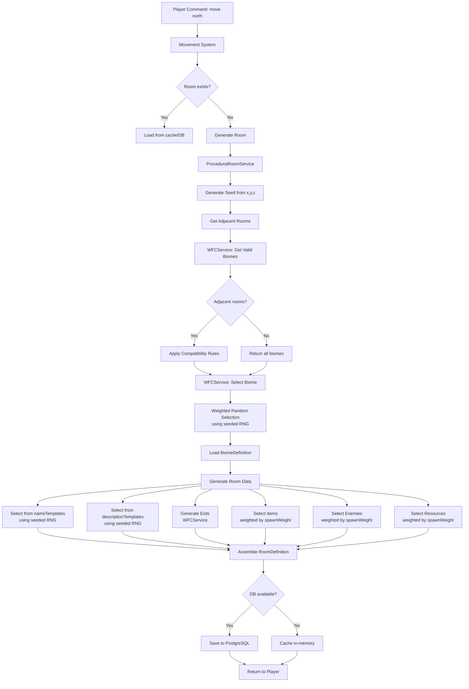

# Procedural Generation Architecture

## System Overview

Verdantia uses a **Wave Function Collapse (WFC)** inspired procedural generation system to create an infinite, explorable world. The system is heavily influenced by **Dwarf Fortress** and generates coherent, biome-based terrain that ensures adjacent rooms follow compatible biome rules.

Key principles:
- **Deterministic generation**: Same coordinates always produce identical rooms
- **Lazy generation**: Rooms are generated on-demand when players explore
- **Biome coherence**: Adjacent rooms respect biome compatibility rules
- **Database-optional**: Works in-memory or with PostgreSQL persistence
- **Coordinate-based seeding**: All randomness derives from (x, y, z) coordinates

---

## Architecture Diagram



---

## Current Implementation Status

The current system implements **Phase 0: WFC-based biome generation** with the following features:

### Implemented
- Coordinate-based room generation (x, y, z)
- Wave Function Collapse for biome selection
- Biome compatibility constraints
- Deterministic seeded random generation
- Exit generation (horizontal + vertical for caves)
- Difficulty calculation based on distance
- Item/enemy/resource selection from biome pools
- Database persistence (optional)
- In-memory caching

### Planned Expansions
The architecture is designed to support future expansion with:
- **Settlement generation** (villages, towns, cities)
- **NPC generation** (personalities, secrets, relationships)
- **Building generation** (shops, homes, temples)
- **Quest generation** (problems, hooks, rewards)
- **Template-based prose generation** (grammar system)

---

## Data Structures

### Core Entities

#### ProceduralRoom
```typescript
{
  id: string;              // "proc_x_y_z"
  x: number;
  y: number;
  z: number;
  biome: BiomeDefinition;  // Reference to biome
  name: string;            // Selected from biome.nameTemplates
  description: string;     // Selected from biome.descriptionTemplates
  difficulty: number;      // 1-10, based on distance + depth
  seed: number;            // Deterministic seed from coordinates
  createdAt: Date;
}
```

#### BiomeDefinition
```typescript
{
  id: string;                    // 'wilderness', 'caves', 'ruins'
  name: string;
  nameTemplates: string[];       // Pool of room names
  descriptionTemplates: string[];// Pool of descriptions
  baseEncounterChance: number;   // 0.0 - 1.0
}
```

#### BiomeCompatibility
```typescript
{
  biome: BiomeDefinition;        // Source biome
  compatibleWith: BiomeDefinition; // Compatible neighbor
}
```

#### BiomeItemPool
```typescript
{
  biome: BiomeDefinition;
  item: ItemDefinition;
  spawnWeight: number;      // Relative probability
  minDifficulty: number;
  maxDifficulty: number;
}
```

#### BiomeEnemyPool
```typescript
{
  biome: BiomeDefinition;
  enemy: EnemyDefinition;
  spawnWeight: number;
  minDifficulty: number;
  maxDifficulty: number;
}
```

#### BiomeResourcePool
```typescript
{
  biome: BiomeDefinition;
  resource: ResourceNodeDefinition;
  spawnWeight: number;
}
```

#### RoomDefinition (Runtime)
```typescript
{
  id: string;
  name: string;
  description: string;
  exits: Array<{
    direction: string;
    roomId: string;
    description?: string;
  }>;
  items: string[];         // Item IDs
  enemies: string[];       // Enemy IDs
  resourceNodes: string[]; // Resource IDs
}
```

---

## Service Responsibilities

### ProceduralRoomService

**Role**: Main orchestrator for room generation

**Key Methods**:
- `getOrGenerateRoom(x, y, z)` - Entry point, checks cache/DB before generating
- `generateRoom(x, y, z)` - Full generation pipeline
- `getAdjacentRooms(x, y, z)` - Loads neighbor data for WFC
- `selectItems/Enemies/Resources(biomeId, difficulty, seed)` - Content selection

**Responsibilities**:
1. Generate deterministic seed from coordinates
2. Coordinate WFC biome selection
3. Select room name and description from biome templates
4. Generate exits (delegates to WFCService)
5. Select items, enemies, and resources from biome pools
6. Persist to database or cache in-memory
7. Assemble final RoomDefinition

### WFCService

**Role**: Wave Function Collapse algorithm for biome selection

**Key Methods**:
- `getValidBiomes(x, y, z, adjacentRooms)` - Apply compatibility constraints
- `selectBiome(validBiomes, x, y, z, rng)` - Weighted random selection
- `generateExits(x, y, z, biome, adjacentRooms, rng)` - Create exits
- `calculateDifficulty(x, y, z)` - Distance-based difficulty

**Responsibilities**:
1. Enforce biome compatibility rules
2. Weight biomes by position (wilderness near origin, caves underground, ruins at medium distance)
3. Generate exits to adjacent rooms
4. Calculate room difficulty based on Manhattan distance + depth

**Biome Weighting Logic**:
- **Wilderness**: Preferred near origin (0,0,0), weight decreases with distance
- **Caves**: Preferred underground (z < 0), weight increases with depth
- **Ruins**: Preferred at medium distance (10-30 units from origin)

### DefinitionService

**Role**: Loads biome, item, enemy, and resource definitions from database

**Responsibilities**:
1. Provide access to BiomeDefinition data
2. Cache definitions for performance
3. Handle database connection failures gracefully

---

## Biome System

### Default Biomes

1. **Wilderness**
   - Surface level (z = 0)
   - Compatible with: wilderness, caves, ruins
   - Horizontal exits only
   - Example names: "Forest Clearing", "Grassy Meadow"

2. **Caves**
   - Underground (z < 0 preferred)
   - Compatible with: wilderness, caves
   - Horizontal + vertical exits (up/down)
   - Example names: "Dark Cavern", "Stone Passage"

3. **Ruins**
   - Medium distance from origin
   - Compatible with: wilderness, ruins
   - Horizontal exits only
   - Example names: "Crumbling Hall", "Ancient Chamber"

### Compatibility Rules

Biomes specify which other biomes can be adjacent. This prevents nonsensical transitions (e.g., ruins suddenly turning into deep caves).

**Default Compatibility Matrix**:
```
              wilderness  caves  ruins
wilderness         ✓        ✓      ✓
caves              ✓        ✓      ✗
ruins              ✓        ✗      ✓
```

When a room is generated, the WFC algorithm:
1. Checks all existing adjacent rooms
2. Finds biomes compatible with ALL neighbors
3. If no compatible biomes exist, uses fallback (most common neighbor biome)
4. Applies position-based weighting
5. Selects biome using seeded random number generator

---

## Determinism Guarantee

Every aspect of room generation is deterministic and reproducible:

### Seed Generation
```typescript
generateSeed(x: number, y: number, z: number): number {
  let hash = 0;
  const str = `${x},${y},${z}`;
  for (let i = 0; i < str.length; i++) {
    hash = ((hash << 5) - hash) + str.charCodeAt(i);
    hash = hash & hash; // Convert to 32bit integer
  }
  return Math.abs(hash);
}
```

### Seeded Random Number Generator
```typescript
seededRandom(seed: number): () => number {
  let state = seed;
  return () => {
    state = (state * 1664525 + 1013904223) % 4294967296;
    return state / 4294967296;
  };
}
```

This Linear Congruential Generator (LCG) ensures:
- Same seed always produces the same sequence of random numbers
- All random decisions (biome, templates, items, enemies) are reproducible
- Multiplayer or save/load scenarios see identical worlds

### Reproducibility Chain

1. **Coordinates** (x, y, z) → deterministic seed
2. **Seed** → seeded RNG instance
3. **Seeded RNG** → all random selections:
   - Biome selection
   - Name template choice
   - Description template choice
   - Exit generation (shuffle + selection)
   - Item count + weighted selection
   - Enemy count + weighted selection
   - Resource count + weighted selection

Result: Visiting (7, 0, 0) will ALWAYS generate the same room, regardless of:
- When you visit it
- What route you took to get there
- Whether the server restarted
- Whether you loaded from a save

---

## Exit Generation

### Horizontal Exits (all biomes)
- **North**: (x, y-1, z)
- **South**: (x, y+1, z)
- **East**: (x+1, y, z)
- **West**: (x-1, y, z)

### Vertical Exits (caves only)
- **Up**: (x, y, z+1)
- **Down**: (x, y, z-1)

### Exit Generation Logic
1. Create bidirectional exits to all adjacent generated rooms
2. Add 1-3 random exits to ungenerated rooms
3. Use seeded Fisher-Yates shuffle to select directions
4. Ensure caves can have up/down exits, others cannot

---

## Content Selection

### Items
- Select from `BiomeItemPool` for current biome
- Filter by difficulty range
- Use weighted random selection based on `spawnWeight`
- Generate 0-3 items per room (30% chance of 0)

### Enemies
- Select from `BiomeEnemyPool` for current biome
- Filter by difficulty range
- Use weighted random selection based on `spawnWeight`
- Generate 0-2 enemies per room (40% chance of 0)

### Resources
- Select from `BiomeResourcePool` for current biome
- No difficulty filtering
- Use weighted random selection based on `spawnWeight`
- Generate 0-2 resources per room (60% chance of 0)

All selections use coordinate-derived seeds for determinism.

---

## Example Generation Flow

**Scenario**: Player moves north from portal (0, 0, 0) to (0, -1, 0)

### Step 1: Seed Generation
```typescript
seed = generateSeed(0, -1, 0)
// "0,-1,0" → hash → 3104412
rng = seededRandom(3104412)
```

### Step 2: Check Adjacent Rooms
```typescript
adjacentRooms = getAdjacentRooms(0, -1, 0)
// Returns: [{ x: 0, y: 0, z: 0, biomeId: 'wilderness' }] (portal room)
```

### Step 3: WFC - Get Valid Biomes
```typescript
validBiomes = wfcService.getValidBiomes(0, -1, 0, adjacentRooms)
// Portal is wilderness
// Wilderness is compatible with: wilderness, caves, ruins
// Returns: ['wilderness', 'caves', 'ruins']
```

### Step 4: WFC - Select Biome
```typescript
selectedBiome = wfcService.selectBiome(validBiomes, 0, -1, 0, rng)
// Position (0, -1, 0) is very close to origin (distance = 1)
// Wilderness gets high weight (1.0 - 1/20 = 0.95)
// Caves and ruins get lower weights
// Seeded random selection → likely 'wilderness'
```

### Step 5: Load Biome Definition
```typescript
biome = getBiome('wilderness')
// {
//   id: 'wilderness',
//   nameTemplates: ['Forest Clearing', 'Grassy Meadow', 'Dense Thicket', ...],
//   descriptionTemplates: ['Sunlight filters through...', 'The grass...', ...]
// }
```

### Step 6: Select Name and Description
```typescript
name = selectRandomSeeded(biome.nameTemplates, rng)
// rng() * 10 → index 3 → 'Dense Thicket'

description = selectRandomSeeded(biome.descriptionTemplates, rng)
// rng() * 10 → index 7 → 'The grass sways gently in the breeze.'
```

### Step 7: Generate Exits
```typescript
exits = wfcService.generateExits(0, -1, 0, biome, adjacentRooms, rng)
// Bidirectional exit: south to (0, 0, 0) - portal room
// Random exits (1-3): rng() → 2 exits
// Available: north, east, west (south taken)
// Fisher-Yates shuffle using rng → [west, north, east]
// Take first 2 → west (x:-1, y:-1, z:0), north (x:0, y:-2, z:0)
// Returns: [
//   { direction: 'south', destinationRoomId: 'proc_0_0_0' },
//   { direction: 'west', destinationRoomId: 'proc_-1_-1_0' },
//   { direction: 'north', destinationRoomId: 'proc_0_-2_0' }
// ]
```

### Step 8: Calculate Difficulty
```typescript
difficulty = wfcService.calculateDifficulty(0, -1, 0)
// manhattanDistance = |0| + |-1| = 1
// depthBonus = 0 (z = 0)
// difficulty = min(10, floor(1/5) + 1 + 0) = 1
```

### Step 9: Select Items
```typescript
items = selectItems('wilderness', 1, 3104412)
// Load BiomeItemPool for wilderness, difficulty 1
// rng1() → 0.7 → not empty (70% chance of items)
// rng2() → 0.4 → 1 item
// Weighted selection from pool using rng3()
// Returns: ['herb_1'] (example)
```

### Step 10: Select Enemies
```typescript
enemies = selectEnemies('wilderness', 1, 3104512)
// seed + 100 offset
// rng1() → 0.5 → not empty (60% chance)
// rng2() → 0.3 → 1 enemy
// Returns: ['wolf'] (example)
```

### Step 11: Select Resources
```typescript
resources = selectResources('wilderness', 3104612)
// seed + 200 offset
// rng1() → 0.3 → not empty (40% chance)
// rng2() → 0.8 → 2 resources
// Returns: ['tree_oak', 'rock_flint'] (example)
```

### Step 12: Save and Return
```typescript
room = {
  id: 'proc_0_-1_0',
  name: 'Dense Thicket',
  description: 'The grass sways gently in the breeze.',
  exits: [
    { direction: 'south', roomId: 'proc_0_0_0' },
    { direction: 'west', roomId: 'proc_-1_-1_0' },
    { direction: 'north', roomId: 'proc_0_-2_0' }
  ],
  items: ['herb_1'],
  enemies: ['wolf'],
  resourceNodes: ['tree_oak', 'rock_flint']
}

// Save to DB (if available) or cache in-memory
// Return to player
```

### Result
Player sees:
```
Dense Thicket
The grass sways gently in the breeze.

Exits: south, west, north
Items: Healing Herb
Enemies: Wolf
Resources: Oak Tree, Flint Rock
```

If the player ever returns to (0, -1, 0) from any direction, they will see the EXACT same room.

---

## Future Extensions

### Planned Template Syntax (for settlements/NPCs)

When the system expands to generate settlements, NPCs, and quests, it will use a grammar-based template engine:

#### Variable Substitution
```
{variable}
Example: "The {npc.name} greets you."
Result: "The Aldric greets you."
```

#### Random Selection (Seeded)
```
{$choice1|choice2|choice3}
Example: "The {$old|ancient|weathered} building stands before you."
Result: "The ancient building stands before you."
```

#### Conditionals
```
{?condition:true text}
{?condition:true|false}
Example: "The merchant {?inventory.length>0:has goods for sale|has nothing to sell}."
Result: "The merchant has goods for sale."
```

#### Nested Templates
```
{@templateRef}
Example: "The town has {@buildingList}."
Result: "The town has a blacksmith, an inn, and a temple."
```

#### Directional Context
```
{#north.biome}
Example: "To the north lies {#north.biome}."
Result: "To the north lies a dark forest."
```

### Planned Generators

#### WorldRegionService
Determine region type from coordinates:
- Villages: `(x + y) % 7 === 0` on surface
- Towns: `(x + y) % 21 === 0` on surface
- Cities: `(x + y) % 63 === 0` on surface
- Minimum distance: 3 coordinates between settlements

#### SettlementGenerator
Generate settlement data:
- Size, prosperity, population
- Historical events
- Current problems (quest hooks)
- Resources and trade goods
- Notable buildings

#### NPCGenerator
Generate NPC data:
- Name, race, occupation
- Personality traits
- Secrets and backstory
- Relationships with other NPCs
- Quest availability

#### BuildingGenerator
Generate building data:
- Type (shop, home, temple, etc.)
- Owner NPC
- Inventory/services
- Interior description
- Connected quests

#### QuestGenerator
Generate quest data from semantic information:
- Problem source (settlement, NPC, event)
- Quest type (fetch, kill, escort, etc.)
- Rewards
- Requirements
- Failure conditions

---

## Performance Considerations

### Caching Strategy
1. **In-memory cache**: All generated rooms cached in Map
2. **Database persistence**: Rooms saved to PostgreSQL (optional)
3. **Lazy loading**: Only generate/load when player moves

### Database Queries
- Use `populate` to avoid N+1 queries
- Batch load items/enemies/resources
- Index on room coordinates (x, y, z)
- Index on biome compatibility

### Memory Management
- No limit on cache size currently (rooms are small)
- Future: LRU cache with max size
- Future: Unload rooms far from any active player

---

## Testing Strategy

### Unit Tests
- Seed generation produces consistent results
- Seeded RNG produces reproducible sequences
- Biome compatibility logic
- Difficulty calculation
- Weighted random selection

### Integration Tests
- Same coordinates always generate same room
- Adjacent rooms respect compatibility
- Exit generation creates bidirectional connections
- Database persistence round-trips correctly

### Manual Testing
- Explore world and verify biome coherence
- Check that returning to a room shows same content
- Verify vertical exits only appear in caves
- Check difficulty increases with distance

---

## Configuration

### Environment Variables
None required. System works with or without database.

### Database Schema
Auto-generated by MikroORM on first run. Key tables:
- `biome_definition`
- `biome_compatibility`
- `biome_item_pool`
- `biome_enemy_pool`
- `biome_resource_pool`
- `procedural_room`
- `procedural_room_exit`
- `procedural_room_item`
- `procedural_room_enemy`
- `procedural_room_resource`

### Default Configuration
- Default biomes: wilderness, caves, ruins
- Default compatibility: hardcoded fallback
- Difficulty range: 1-10
- Max items per room: 3
- Max enemies per room: 2
- Max resources per room: 2

---

## Troubleshooting

### Room generation fails
- Check biome definitions exist in database
- Verify biome compatibility rules are set
- Check item/enemy/resource pools have entries
- Enable debug logging: `this.logger.debug()`

### Rooms not deterministic
- Verify seed generation is consistent
- Check all random operations use seeded RNG
- Ensure no external randomness sources (Date.now(), Math.random())

### Biome transitions feel abrupt
- Add more biome types
- Fine-tune compatibility rules
- Adjust biome weighting in WFCService
- Add transition biomes (e.g., "forest edge" between wilderness and ruins)

### Performance issues
- Enable database persistence to reduce regeneration
- Profile ProceduralRoomService.generateRoom()
- Check for N+1 queries in content selection
- Consider caching BiomeDefinition data

---

## Related Files

- `/apps/server/src/game/world/procedural-room.service.ts` - Main generation service
- `/apps/server/src/game/world/wfc/wfc.service.ts` - Wave Function Collapse algorithm
- `/apps/server/src/game/world/definition.service.ts` - Biome/item/enemy definition loader
- `/apps/server/src/entities/procedural-room.entity.ts` - Room entity
- `/apps/server/src/entities/biome-definition.entity.ts` - Biome entity
- `/apps/server/src/entities/biome-compatibility.entity.ts` - Compatibility rules
- `/packages/shared/src/procedural.ts` - Shared types and utilities

---

## References

- [Wave Function Collapse Algorithm](https://github.com/mxgmn/WaveFunctionCollapse)
- [Dwarf Fortress World Generation](http://www.bay12games.com/dwarves/)
- [Procedural Content Generation in Games](https://pcgbook.com/)
- [Linear Congruential Generator](https://en.wikipedia.org/wiki/Linear_congruential_generator)
